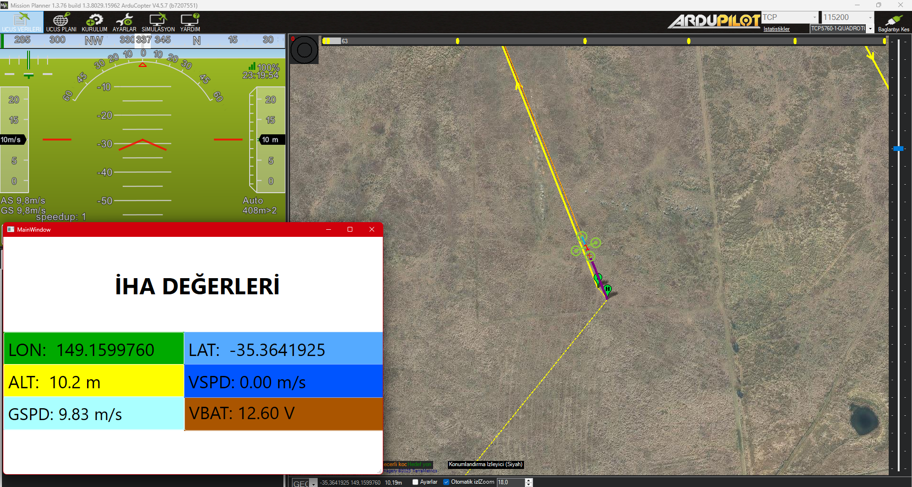
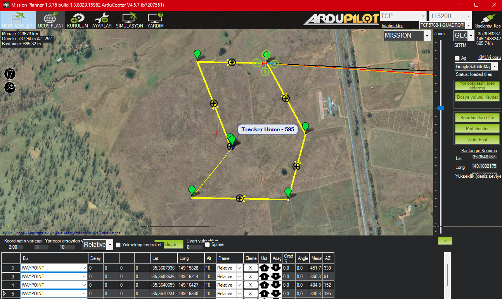

<h1 align="center">UAVTelemViewer</h1>

  <em>Qt 6 + C++ + Python ile gerçek-zamanlı ArduPilot telemetri paneli</em>

---

## Genel Bakış
UAVTelemViewer, Mission Planner / SITL’den gelen **MAVLink** verilerini
Python köprüsü üzerinden alır (TCP 5760 → 6000) ve Qt 6 arayüzünde
renkli “Hızlı Veri” paneli şeklinde gösterir.

| Gösterge | MAVLink Mesajı | Alan            |
|----------|----------------|-----------------|
| **LAT/LON/ALT** | `GLOBAL_POSITION_INT` | lat / lon / alt (mm) |
| **GSPD / VSPD** | `VFR_HUD`             | ground & climb speed |
| **VBAT**        | `SYS_STATUS`          | voltage (mV)         |

---

## 🗂️ Proje Yapısı

UAVTelemViewer/
├─ src/ # Qt C++ kaynakları
│ ├─ main.cpp
│ ├─ mainwindow.{h,cpp}
│ └─ mainwindow.ui
├─ mavlink_listener.py # Python köprüsü (pymavlink)
├─ CMakeLists.txt # Qt 6 CMake yapılandırması
├─ .gitignore
└─ docs/ screenshot.png

##  Gereksinimler

| Yazılım | Sürüm / Not |
|---------|-------------|
| **Qt 6** | ≥ 6.5 (MSVC 2022 x64 veya MinGW) |
| **Python** | 3.9+ |
| `pymavlink` | `pip install pymavlink` |

## Çalıştırma

 1) Mission Planner
Simülasyon Menüsü ▸ Araç Seç ▸Bağlan
Ctrl+F ▸ Mavlink ▸ TCP Host 14550 ▸ Start
Uçuş Planı ▸ Hedefleri Seç ▸ Kalkış İniş Planla 
Uçuş Verileri ▸ Komut ▸ Otomatik Mod ▸ Etkinleştir

# 2) Python köprüsü
python mavlink_listener.py   # 5760 dinler, GUI için 6000 açar

# 3) Qt GUI
./build/UAVTelemViewer.exe   # TCP 6000'e bağlanır

## Ekran Görüntüleri

 ## Neler Eklenebilir?

 UI’den komut gönderme (ARM, TAKEOFF)

 Harita mini-görünümü (Qt Location)

 Arayüz görsel iyileştirmesi

